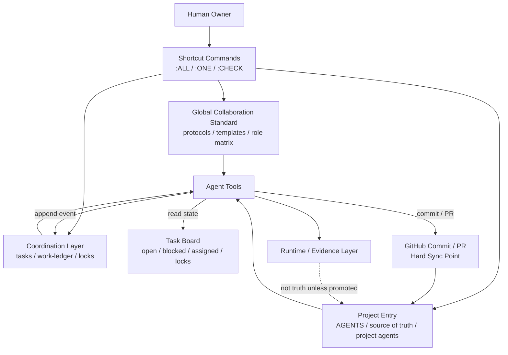
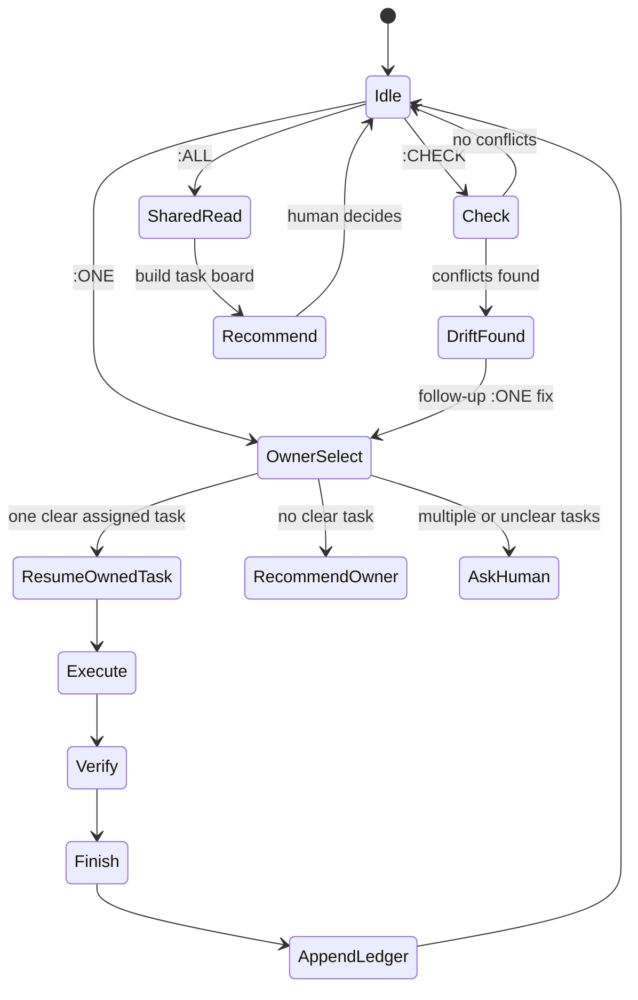

# 多 Agent 协作操作系统说明书

> 本文是通用协作体系说明，不包含任何个人账号、私有仓库地址、生产域名、密钥、token 或其他敏感资源标识。所有实际资源统一用“全局标准仓库”“项目仓库”“生产运行面”“工具本地规则层”等通用名指代。

## 1. 一句话定义

这套体系把多个 AI 开发工具从“各自理解、聊天传话、手工同步”升级为“共同读取真源、按任务锁协作、把状态回写共享区、用统一收尾指令继续推进”的协作操作系统。

它解决的不是单个工具能不能写代码，而是多个工具、多个会话、多个环境在同一项目上如何不抢活、不误读、不丢上下文、不把临时判断当成长期真相。

## 2. 核心价值

| 价值 | 说明 |
|---|---|
| 降低跨工具复制成本 | 用户只需输入短指令，工具从 GitHub 真源和 coordination 区读取上下文。 |
| 降低并发冲突 | 串行任务有 owner 和 lock，并行任务有独立 scope、branch 或 task record。 |
| 保持真源一致 | 规则、任务、收尾、回滚、验证都以 GitHub 文件、commit、branch、PR 为硬同步点。 |
| 提升可恢复性 | 任意工具中断后，下一工具可通过 task record 和 ledger 接续。 |
| 防止短修补变成长期债 | 最小动作只是验证策略，长期正确和剩余收敛工作必须显式保留。 |
| 减少隐式记忆依赖 | 聊天记录只负责触发，不能作为唯一状态载体。 |

## 3. 适用对象

| 工具类型 | 默认定位 | 典型工作 |
|---|---|---|
| 主控 IDE Agent | 项目 owner、架构控制、最终集成 | 真源更新、任务拆解、跨工具收口、最终 commit/PR。 |
| 专项代码 Agent | 实现、调试、重构、代码审查 | 按 `:ONE` 领取明确 scope 的代码任务。 |
| 自主执行 Agent | 独立任务执行者 | 按 task pack 或明确分支完成较完整切片。 |
| 沙箱/云端 Agent | 只读审查、小补丁、隔离验证 | 读取远端真源，不依赖本地路径。 |
| 架构/文本审查 Agent | 架构评审、文档审查、规则审查 | 只读审查为主，必要时通过 task pack 写入。 |
| 人类 owner | 最终决策者 | 指定方向、批准高风险动作、决定下一项任务。 |

## 4. 分层架构



## 5. 真源模型

| 层级 | 作用 | 是否权威 |
|---|---|---|
| 全局标准仓库 | 跨项目通用协议、命令、模板、角色矩阵 | 是，全局规则真源 |
| 项目入口文件 | 项目定位、工具登记、项目边界、当前 source of truth | 是，项目规则真源 |
| Coordination 区 | 当前任务、任务锁、append-only 事件、交接状态 | 是，当前协作状态真源 |
| Commit / Branch / PR | 代码和文档硬同步点 | 是，工程硬真源 |
| 云文档 / 知识库 | 给人阅读和培训的知识资产 | 是，说明性资产；不替代 Git 真源 |
| 聊天记录 | 发起、审批、解释 | 否，不能作为唯一状态载体 |
| 运行日志 / 截图 / 数据库 | 证据或运行产物 | 否，除非被显式提升为证据资产 |

## 6. 快捷指令

### 6.1 `:ALL`

用途：多工具共享状态加载。

默认行为：

- 读取全局标准、项目入口、项目工具登记、当前真源、coordination、active tasks、Git 状态。
- 构建 task board：open / blocked / assigned / active lock / branch / HEAD / dirty state。
- 输出 Collaboration State。
- 推荐下一步 command、owner、owner reason。
- 不 claim、不编辑、不 stage、不 commit、不 push。

适用场景：

- 新会话开始。
- 不确定当前谁在做什么。
- 多工具需要先同步状态。
- 项目长时间暂停后恢复。

### 6.2 `:ONE`

用途：单 owner 执行或续做已分配任务。

默认行为：

- 读取同样真源。
- 查找明确分配给当前工具且未完成的任务。
- 如果恰好一条任务且 scope 清楚，先复述 goal / scope / risk / intended files / verification，再继续。
- 如果没有 assigned task，推荐最安全 owner 和下一步指令。
- 如果多个任务或 scope 不清，列出选项并请求选择。

安全边界：

- 不静默扩大 scope。
- 不在 owner 不明确时动手。
- 不抢其他工具的 serial lock。
- 不触碰 protected files，除非该任务明确拥有它们。

### 6.3 `:CHECK`

用途：自检本地环境是否与 GitHub 真源一致。

默认行为：

- 读取 GitHub 真源。
- 对比本地规则、技能、模板、记忆、项目规则、Git 状态。
- 报告 conflicts / stale / missing / action needed。
- 在项目允许且工具有安全写权限时，追加 coordination event。
- 不自动改写本地规则或仓库文件；修复必须另开 `:ONE`。

适用场景：

- 工具换会话、换环境、清缓存后。
- 规则刚更新后。
- 怀疑某个工具记忆落后。
- 发现输出风格或执行边界不一致。

## 7. 指令别名与输入规则

| 类型 | 状态 |
|---|---|
| `:ALL` / `:ONE` / `:CHECK` | 主规范，优先使用 |
| `：ALL` / `：ONE` / `：CHECK` | 中文输入法全角别名，可归一化 |
| `::ALL` / `::ONE` / `::CHECK` | 兼容别名，不主动输出 |
| `/ALL` / `/one` | 历史兼容别名，不主动输出 |
| 单独 `:` | 无效命令 |

选择单冒号的原因：

- 避免与软件原生 slash command 或 skill 唤起冲突。
- 比双冒号更容易输入。
- 仍足够醒目，不容易和自然语言混淆。
- 可兼容中文全角冒号输入。

## 8. 协作状态机



## 9. 任务锁模型

| 模式 | 使用条件 | 规则 |
|---|---|---|
| Serial | 一个 owner 执行，其他工具观察 | 一个 owner、一个 branch 或 commit target、一个 task record；其他工具只读或 review。 |
| Parallel | 任务可拆成不重叠 scope | 每个 owner 有独立 task record、branch 或文件范围；protected files 同时只允许一个 owner。 |
| Review-only | 只读审查 | 不编辑、不 stage、不 commit、不 push，只输出 findings 和 next command。 |

## 10. Protected Files

Protected files 是项目控制面，不允许多个工具同时修改。典型包括：

- 项目入口文件
- 项目工具登记文件
- 当前 source-of-truth 文件
- 文档索引
- Git 忽略规则
- 各工具项目入口文件
- coordination schema / ledger / active task record

如果任务涉及 protected files：

- 必须先读取 active tasks 和 work ledger。
- 如已有 owner，停止并报告冲突。
- 如需并行，必须拆分 scope 或指定 integrator。

## 11. Append-only Coordination

coordination 区是跨工具通信区。事件只追加，不重写他人记录。

典型事件：

| 事件 | 含义 |
|---|---|
| `start` | 任务开始，声明 owner / scope / lock |
| `claim` | 工具领取任务 |
| `update` | 状态更新或纠偏 |
| `blocked` | 阻塞，需要人类或其他工具处理 |
| `handoff` | 交接给另一个工具 |
| `review` | 只读审查结果 |
| `finish` | 任务完成 |
| `archive` | 归档 |

纠错方式：追加新事件 supersede 旧事件，而不是修改旧事件。

## 12. 收尾协议

每个有意义步骤完成后必须输出：

- Changed
- Verified
- Not verified
- Risk
- Commit / PR
- Handoff
- Recommended next command
- Recommended next owner
- Owner reason
- Rollback target
- Rollback method
- Rollback verification

其中最关键的是三个下一步字段：

| 字段 | 作用 |
|---|---|
| Recommended next command | 让用户能直接复制到任意工具继续 |
| Recommended next owner | 指明下一步最安全执行者 |
| Owner reason | 解释为什么该工具最适合做 |

## 13. 工具分工

| 工具 | 默认权限 | 最适合做 | 不适合做 |
|---|---|---|---|
| 主控 IDE Agent | 本地写入，需审批 push | 规则收口、最终集成、跨工具调度 | 未确认时直接改生产运行面 |
| 专项代码 Agent | task-scoped write | 代码实现、调试、测试、重构 | 无 task record 时大范围改造 |
| 自主执行 Agent | task-package driven | 独立切片实现、长任务推进 | 未分支隔离时改 protected files |
| 沙箱 Agent | 默认只读 | PR / diff review、小范围验证 | 依赖本地路径或直接推主干 |
| 架构审查 Agent | 默认只读 | 架构评审、文案和规则审查 | 未授权写仓库 |
| 人类 owner | 决策和审批 | 方向、优先级、高风险批准 | 手动搬运大量上下文 |

## 14. 设计原则

1. 真源优先：代码和文档以 GitHub commit / branch / PR 为硬同步点。
2. 最小动作：先做最小可验证动作，但不把临时补丁当长期方案。
3. 长期正确：每个最小动作都要保留收敛方向和剩余工作。
4. 单 owner：默认一个任务一个 owner，其他工具只读。
5. 并行需拆边界：并行必须有独立 scope、branch 或 task record。
6. 可回退：重要变更必须有 rollback target / method / verification。
7. 不依赖聊天：聊天触发任务，GitHub 文件承载状态。
8. 默认保守：不确定 owner、scope、lock、权限时先停。
9. 规则做减法：全局规则只收跨项目、可复用、低负担协议。
10. 敏感信息不落文档：不写明文账号、链接、token、key、生产域名。

## 15. 安全边界

禁止默认执行：

- 推送主分支
- 强制 reset / rebase / force push
- 删除文件或数据
- 修改密钥、环境变量、权限配置
- 直接编辑生产运行面
- 未授权读取或输出敏感信息
- 把私有资源明文写入通用文档

允许默认执行：

- 只读读取 Git 状态
- 只读读取规则和任务记录
- 生成 task board
- 输出建议 owner 和下一步指令
- 在允许时追加 coordination event

## 16. 推荐启动方式

### 状态同步

```text
:ALL
```

### 单工具执行

```text
:ONE owner=<tool> task=<goal> scope=<files-or-boundary>
```

### 不确定谁做

```text
:ONE 看下这个问题下一步谁做最合适
```

### 工具自检

```text
:CHECK
```

## 17. 培训检查清单

- [ ] 工具是否能读取全局标准和项目入口。
- [ ] 工具是否理解 `:ALL` 只读推荐，不默认执行。
- [ ] 工具是否理解 `:ONE` 只续做明确 owner 和 scope 的任务。
- [ ] 工具是否理解 `:CHECK` 自检但不自动修。
- [ ] 工具是否会输出 Recommended next command / owner / reason。
- [ ] 工具是否知道 protected files 一次一个 owner。
- [ ] 工具是否能在发现冲突时停止并报告。

## 18. 最终判断

这套体系的目标不是制造更多规则，而是让多个 AI 工具像一个克制的产研团队一样工作：

- 有共同语言。
- 有真源。
- 有任务锁。
- 有收尾和下一步。
- 有回退边界。
- 有人类最终决策。

当工具只收到 `:ALL`、`:ONE`、`:CHECK` 这类短指令时，也能从真源恢复上下文、判断边界、给出下一步，而不是要求用户反复粘贴长提示词。
